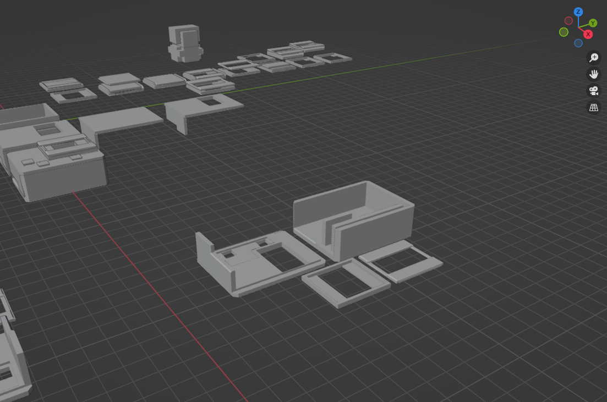

# Physical Computing
Final submission project by Jacob Stenton.

The **Capitalist Clock** 

[device controls](https://git.arts.ac.uk/21026540/Y1PhysicalComputing/blob/main/README.md#controls)

## Inspiration
The original idea for this project started as some sort of **desktop device** that tracks a **monetary value**.
A type of clock seemed fitting for this kind of project - its something that most people have on their desk or bedside table.
The idea I came to, was a * *clock* * that tracks how much money someone earns every second based on their yearly salary.

With the thought of money in mind, the UI should have a similar theme to trading and stocks. Having values that slowly increase by tiny decimal values.

## Research
Looking at other Arduino projects, there seemed to be a lot of different ways to display data. My main interest was through some kind of screen or counter. I really like the idea of a flipping number display or a nixie tube display (something physical), however I decided these ideas might be too time consuming. Ultimatley, I decided on a OLED screen, as it can give a higher resolution than other screens, as well as a lower power draw, giving me space to develop and change the UI in a unique way.

For the inputs I didn't have to look far as I wanted to make it as simple as possible. I opting for an array of push buttons to control the screen. Similar to the average alarm clock.

## Process & Technical Overview
To start I created a circuit on Tinkercad, which involved a display and push buttons. *(Tinkercad didn't have the exact display I was using, but had a similar LCD with the same connections)* This made it easy for me to recreate the circuit on a breadboard using the OLED.

### code

With this, I started with version **one** of the code, which initially started with connecting and using [4 push buttons](code/4Buttons/4Buttons.ino). The code I made for this would simply output which button was being used into the serial monitor.

I then learned how to display to the OLED screen with [this video by Mikael Abehsera](https://www.youtube.com/watch?v=OzfljKHH0p0). This involed using the Adafruit library SSD1306, which came with exmaples, allowing to to create a [simple text message](code/CapitalClockV1/CapitalClockV1.ino).

During development, I decided I would reduce the buttons from four to three. There didn't seem to be a need for an extra button. This made the code a little more streamline. Going on I created the [second version](code/CapitalClockV2/CapitalClockV2.ino)of the code, which calculated the earnings per second and displayed it.

Finally I moved the code from a much larger Arduino Leonardo to a much smaller Arduino Nano, so I could start putting more focus onto the physical design on the gadget. Because of this change I made a last [Final Version 3](code/CapitalClockV3NANO/CapitalClockV3NANO.ino).

### Final Code

        //BY JACOB STENTON

        #include <SPI.h>
        #include <Wire.h>
        #include <Adafruit_GFX.h>
        #include <Adafruit_SSD1306.h>

        #define SCREEN_WIDTH 128 
        #define SCREEN_HEIGHT 64
        #define OLED_RESET -1

        Adafruit_SSD1306 display(SCREEN_WIDTH, SCREEN_HEIGHT, &Wire, OLED_RESET);
        //------------------------------------------------------------------
        // Seconds in a year 31540000

        String amount;
        float salary;
        float savings;
        float count; //initialising basic varibale to calculate earnings per second (eps)

        String useMode = "StartUp";//this determines which screen the display starts in - changeing to "Display" will start on the main display screen
        bool startUp = false;//boolean to determin if the startup screen has already run for later

        #define modeButton 11 //first button - for changing screens
        #define upButton 9 //second - for increasing salary
        #define downButton 5 //third - for decreasing salary

        int modeButtonVal, prevModeButtonVal = 1; //states and previous states for the mode button so it doesn't contantly change modes

        int upButtonVal, downButtonVal, upHold, downHold; //states for up and down buttons, as well as ints to count how long they have been held down

        int seconds, minutes, hours, days, years; //integers for the useage time shown on the main display

        void setup() {
          Serial.begin(9600);//starts serial - mainly for debuging
        //
        if(!display.begin(SSD1306_SWITCHCAPVCC, 0x3C)) {
            Serial.println(F("SSD1306 allocation failed"));
            for(;;)
            ; //code taken from https://www.youtube.com/watch?v=OzfljKHH0p0 - sets up the display and checks it is properly connected
          }

          pinMode(modeButton, INPUT_PULLUP);
          pinMode(upButton, INPUT_PULLUP);
          pinMode(downButton, INPUT_PULLUP); //sets the buttons so they activate when released

          display.clearDisplay();
          display.setTextColor(WHITE); //clears the main display and sets pixel colour to white. - this display only has one colour (white means ON - black OFF)
        }

        void loop() {
        // Mode Button
          //this section controls what the screen is displaying based on what mode it is set to
          modeButtonVal = digitalRead(modeButton); //sets the mode state var to be the same as the mode button
          if (modeButtonVal == LOW && modeButtonVal != prevModeButtonVal) { //if the mode button is pressed and is not the same as its previous state (this prevents continuous presses)
            if (useMode == "Display"){ // if mode is on display 
              useMode = "Salary";//change it to salary
            } else if (useMode == "Salary"){ //if mode is "Salary"
              useMode = "Display"; //change to display
            }
            delay(20);//debounce
          }

          prevModeButtonVal = modeButtonVal; //prevous button value is set to the current value

        // Modes
          if(useMode == "StartUp"){ //if mode is on startup
            display.clearDisplay();

            display.setTextSize(2); //sets text size (1,2,3)
            display.setCursor(24,0); //sets where the text will start 
            display.println("WELCOME");//prints text "welcome" onto screen

            display.setTextSize(1);
            display.setCursor(18,18);
            display.println("by Jacob Stenton");
            display.println();
            display.println("please input your    salary :)"); // basic welcome text to display on the start up screen
            display.display(); //display previosuly set text

            delay(5000); // waits x amount of seconds (5)

            if (startUp == false){ //if first startup
              startUp = true; //startup has now run
              useMode = "Salary";//change mode to salary
            } else {
              useMode = "Display";//if startup has run change screen to the main display

            }

          } else if(useMode == "Display"){//if on disaply screen
              display.clearDisplay();

              display.setTextSize(2);
              display.setCursor(31,0);
              display.println("_GBP_"); //title

              count = salary/31540000; //takes input salary and divides it by seconds in a year.
              savings += count; //adds count to the main savings number
              amount = String(savings, 4); //changes savings into a string with 4 decimal places

              display.setCursor(0,16);
              display.println(amount); //prints the amount

            //SMHDY RUNTIME
              seconds += 1;
              if (seconds == 60){
                seconds = 0;
                minutes += 1;
              }
              if (minutes == 60){
                minutes = 0;
                hours += 1;
              }
              if (hours == 24){
                hours = 0;
                days += 1;
              }
              if (days == 365){
                days = 0;
                years += 1;
              } //calculates how long the gadet has been running for - from seconds to years

              display.setTextSize(1);
              display.setCursor(0,56);
              display.println(String(years) + "Y" + String(days) + "D" + String(hours) + "H" + String(minutes) + "M" + String(seconds) + "S"); //prints time stat

              display.display();
              delay(1000); // does everything once every seconds

          } else if(useMode == "Salary"){
              display.clearDisplay();

              display.setTextSize(2);
              display.setCursor(17,0);
              display.println("_SALARY_"); //title

              display.setTextSize(1);
              display.setCursor(10,20);
              display.println("Earnings per year?"); 

              int buffer; // creates a tempery buffer for text spacing
              if (salary >= 10000000){
                buffer = 18;
              } else if (salary >= 1000000) {
                buffer = 30;
              } else if (salary >= 100000) {
                buffer = 42;
              } else if (salary >= 10000) {
                buffer = 54;
              } else if (salary >= 1000) {
                buffer = 66;
              } else if (salary >= 100) {
                buffer = 78;
              } else {
                buffer = 90; //determines the buffer based on how many digits the input salary has
              } 

        // buttons

              upButtonVal = digitalRead(upButton); // up button value set to the actual button value
              if (upButtonVal == LOW) { // if buttons is pressed down (these buttons should be continuous for ease of input - they dont have a prevoious value or a debounce)
                if(upHold > 200){ //checks if how long the button has been held down
                  salary += 1000000; //increases salary by larger value the longer it has been held down
                } else if (upHold > 100) {
                  salary += 10000;
                } else {
                  salary += 1000;
                }

                if (salary >= 99999999) {
                  salary = 99999000; //stops the salary going too many digits hight - More than 8 or  9 digits seems to cause problems with timing 
                }
                delay(50);
                upHold += 1; // calculates how long the button has been pressed down
              }

              if (upButtonVal == HIGH){
                upHold = 0; // if the button is released the hold down value is reset
              }

              downButtonVal = digitalRead(downButton); //same logic as up button
              if (downButtonVal == LOW) {
                if(downHold > 200){
                  salary -= 1000000;
                } else if (upHold > 50) {
                  salary -= 10000;
                } else {
                  salary -= 1000;
                }

                if (salary < 0){
                  salary = 0;
                }
                delay(50);
                downHold += 1;
              }

              if (downButtonVal == HIGH){
                downHold = 0;
              }

        //-------

              display.setTextSize(2);
              display.setCursor(buffer,34); //uses the buffer to set the cursur
              display.println(String(salary,0)); //turns the salary into a string and displays it

              display.setTextSize(1);
              display.setCursor(0,56);
              display.println("press MODE to confirm");//gives some intruction on how to go back to the main display

              display.display();
          } else {
            // useMode error
              display.clearDisplay();
              display.setTextSize(2);
              display.setCursor(0,40);
              display.println("error");//prints and error message if the modes are not correctly setting
              display.display();
          }
        }

### issues & thoughts - whats to come

Thinking about the code for this projcet, I orignally wanted a way to start up the display by asking how much the user has in savings, however this proved difficult with the limited storage space Arduinos by themselves. On top of this I found they struggled calculating on numbers with lots of digits. To compromise I got rid of this feature. However, its something that I can work around and add later on.

I also had the idea of using a external storage unit like an sd card to save the calculated amounts onto the Arduino. This would mean that if it is turned off, it would still remembers the number it was last at. This is something I would like to look into but might require a lot of testing and research to make work. - Doing this kind of change would also allow the device to be portable (with a battery), as it wouldnt require to be plugged in to work effectively. On top of this it would also be possible to connect the device to wifi allowing it to properly caluclate the amount of time it was shut off. Meaning it can calculate and add the difference to the savings amount it would display.

## Fabrication

After I was happy with the base code and circuitry I moved on to fabricating the whole device. I decided the fastest way to created a protype would be to 3D print it. I started off in Blender modeling the electronics I was using and then modeling around those to create a case.

This was the main model I printed and used to house all the components of the project - The smaller square housing for the OLED screen had to be re-modeled and re-printed twice more as they didnt fit together properly.

If I was to continue this project I would develop a better and more visually appealing case.

Finally, I put everything together in a test fit to ensure it would all work before I started soldering parts together.

## soldering

Lastly, I went onto soldering, where I used the schematic made in Tinkercad as well as the breadboard circuit to create the final prototype.

## Outcome

Finishing with the soldering, I finally put all the peices together.

This is all to create a small desk gadget which counts up your eps! (earning per second) - I personally found this a really a interesting thing to have on my desk. It allows me to see how much each second of time is ultimatley worth in money.

For example this README file took £8.50 to write.

## Controls

The button on the top half is the MODE button

 - pressing this on the salary screen will select the current set salary and change to the main display screen
 - to get back to the salary page you hold the MODE button for 1 second

The two button on ht ebutton half of the device and the UP and Down buttons

 - holding these on the salary page will change the salary value accordingly
 - holding the buttons for longer periods of time will increse the increment of which the salary will increse or decrease

### Turn on:
 - Wait for Salary screen 
 - Use up/down buttons to adjust salary 
 - Press MODE to input 
 - Watch money count up 

### Changing Salary:
 - Press MODE for 1 second 
 - Adjust Salary using up/down buttons 
 - Press MODE again to input
